# 工具實戰與完整專案

## 🛠️ PlantUML 工具介紹

### 📝 什麼是 PlantUML？

PlantUML 是一個開源工具，讓你**用文字描述來生成 UML 圖表**。相比於拖拉式的繪圖工具，PlantUML 有以下優點：

- ✅ **版本控制友善**：文字檔案易於追蹤變更
- ✅ **快速繪製**：打字比拖拉更快
- ✅ **一致性**：自動排版，風格統一
- ✅ **易於維護**：修改文字即可更新圖表
- ✅ **整合開發環境**：VS Code、IntelliJ IDEA 都有擴充套件

---

## 🚀 PlantUML 快速入門

### 安裝與設定

#### 1. 安裝 Java

PlantUML 需要 Java 執行環境。

```powershell
# 檢查是否已安裝 Java
java -version
```

如果沒有安裝，請到 [https://adoptium.net/](https://adoptium.net/) 下載安裝。

#### 2. 安裝 VS Code 擴充套件

在 VS Code 中搜尋並安裝：

- **PlantUML** (作者：jebbs)

#### 3. 創建第一個 UML 檔案

創建 `example.puml` 檔案：

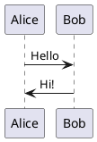

按 `Alt + D` 預覽圖表！

---

## 📊 PlantUML 語法詳解

### 1. 類別圖（Class Diagram）

#### 基本語法

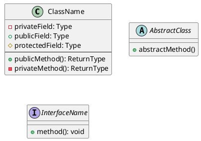

#### 關係表示

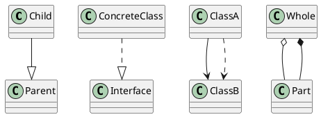

#### 完整範例：RPG 遊戲

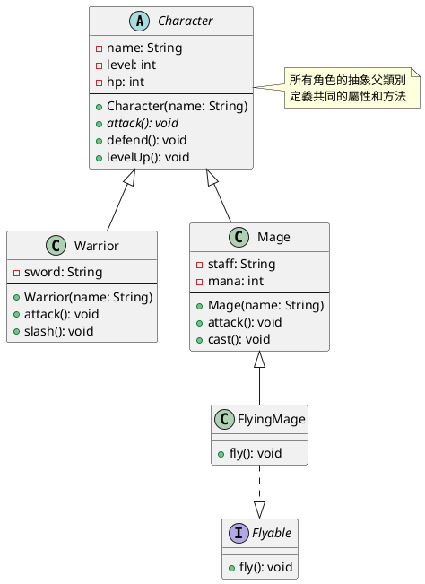

---

### 2. 使用案例圖（Use Case Diagram）

#### 基本語法

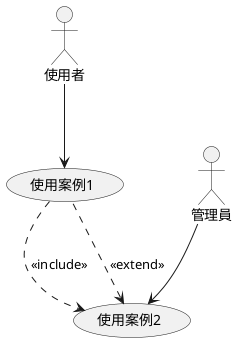

#### 完整範例：線上購物系統

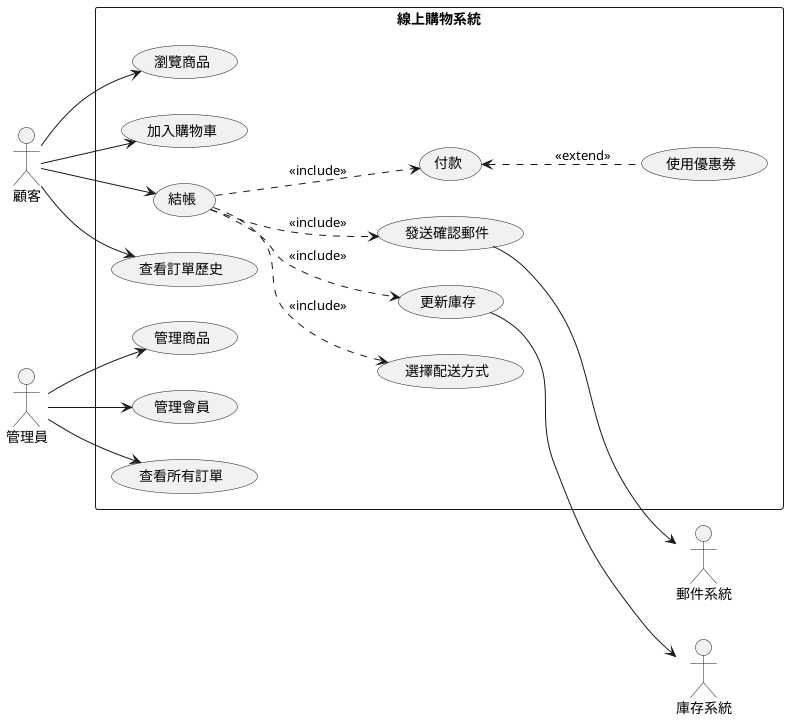

---

### 3. 循序圖（Sequence Diagram）

#### 基本語法

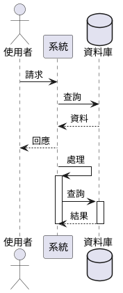

#### 進階語法：條件與迴圈

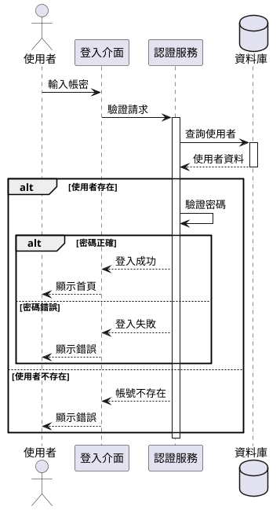

#### 完整範例：結帳流程

```plantuml
@startuml Checkout Process

actor 顧客
participant "結帳介面" as UI
participant "訂單服務" as Order
participant "購物車服務" as Cart
participant "付款服務" as Payment
participant "庫存服務" as Inventory
participant "郵件服務" as Email

顧客 -> UI: 發起結帳
activate UI

UI -> Order: 處理結帳請求
activate Order

Order -> Cart: 取得購物車
activate Cart
Cart --> Order: 購物車資料
deactivate Cart

alt 購物車為空
    Order --> UI: 錯誤：購物車空
    UI --> 顧客: 顯示錯誤訊息
else 購物車有商品
    Order -> Order: 計算總金額
    
    Order --> UI: 顯示金額
    UI --> 顧客: 確認訂單
    
    顧客 -> UI: 選擇付款方式
    UI -> Order: 付款請求
    
    Order -> Payment: 處理付款
    activate Payment
    Payment --> Order: 付款成功
    deactivate Payment
    
    Order -> Order: 建立訂單
    
    ' 平行執行
    par 更新庫存
        Order -> Inventory: 更新庫存
        activate Inventory
        Inventory --> Order: 更新完成
        deactivate Inventory
    and 發送郵件
        Order -> Email: 發送確認郵件
        activate Email
        Email --> Order: 發送完成
        deactivate Email
    end
    
    Order --> UI: 訂單確認
    UI --> 顧客: 顯示成功訊息
end

deactivate Order
deactivate UI

@enduml
```

---

## 💡 設計模式的 UML 表示

### 1. 單例模式（Singleton Pattern）

#### UML 類別圖

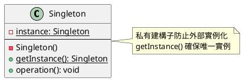

#### Java 實作

```java
public class Singleton {
    private static Singleton instance;
    
    // 私有建構子
    private Singleton() {
    }
    
    // 取得唯一實例（執行緒安全）
    public static synchronized Singleton getInstance() {
        if (instance == null) {
            instance = new Singleton();
        }
        return instance;
    }
    
    public void operation() {
        System.out.println("執行操作");
    }
}
```

---

### 2. 工廠模式（Factory Pattern）

#### UML 類別圖

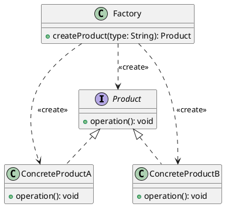

#### Java 實作

```java
// 產品介面
interface Product {
    void operation();
}

// 具體產品 A
class ConcreteProductA implements Product {
    @Override
    public void operation() {
        System.out.println("產品 A 的操作");
    }
}

// 具體產品 B
class ConcreteProductB implements Product {
    @Override
    public void operation() {
        System.out.println("產品 B 的操作");
    }
}

// 工廠
class Factory {
    public Product createProduct(String type) {
        switch (type) {
            case "A":
                return new ConcreteProductA();
            case "B":
                return new ConcreteProductB();
            default:
                throw new IllegalArgumentException("未知的產品類型");
        }
    }
}
```

---

### 3. 觀察者模式（Observer Pattern）

#### UML 類別圖

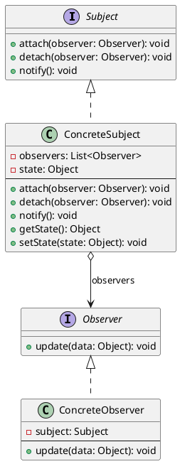

---

### 4. 策略模式（Strategy Pattern）

#### UML 類別圖

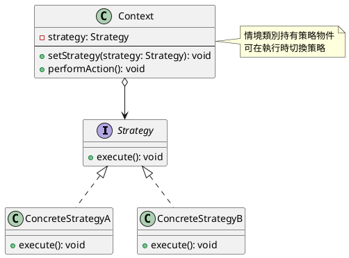

---

## 🏆 完整實戰：圖書館管理系統

現在讓我們設計一個完整的圖書館管理系統，整合所有 UML 圖表！

### 系統需求分析

**功能需求**：

1. **會員功能**
   - 借書（檢查借閱額度）
   - 還書（計算逾期費用）
   - 查詢書籍
   - 預約書籍

2. **管理員功能**
   - 管理書籍（新增、修改、刪除）
   - 管理會員
   - 查看借閱紀錄

3. **系統功能**
   - 書籍狀態管理
   - 借閱歷史記錄
   - 逾期計算

---

### 1. 使用案例圖

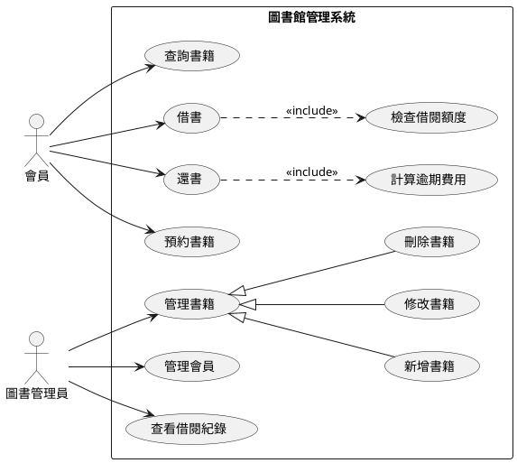

---

### 2. 類別圖

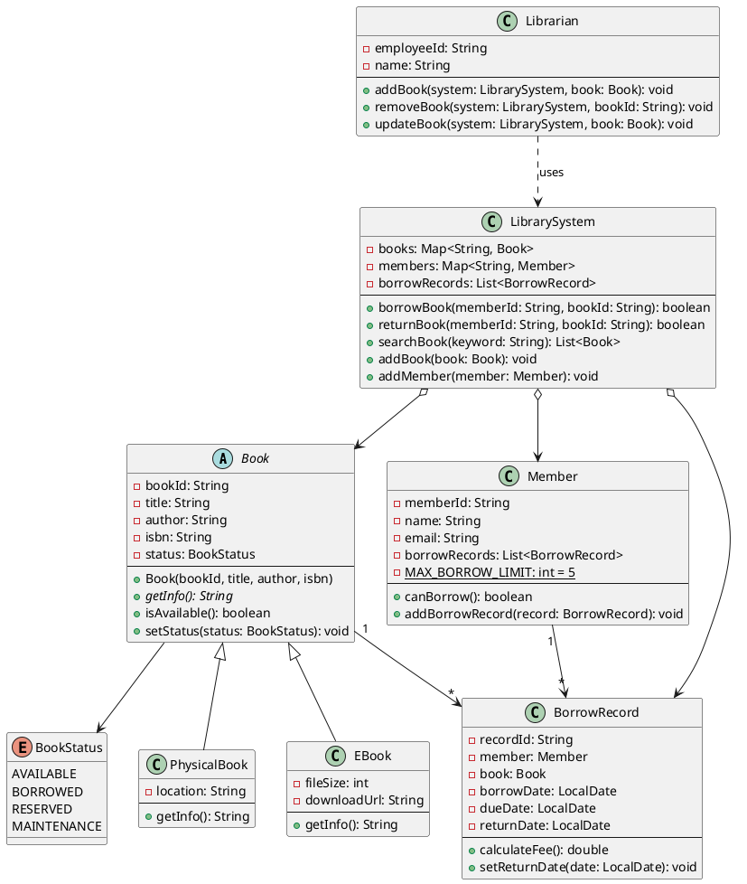

---

### 3. 循序圖：借書流程

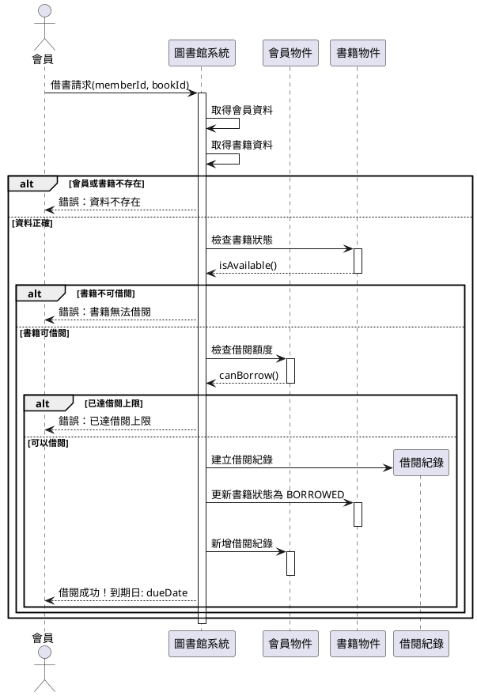

---

### 4. 循序圖：還書流程

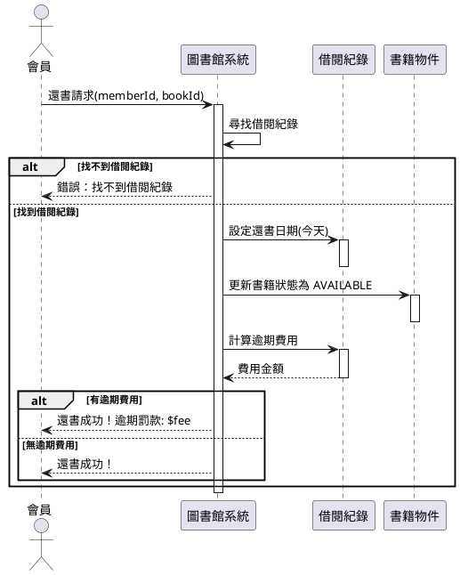

---

### 5. Java 完整實作

#### BookStatus 列舉

```java
public enum BookStatus {
    AVAILABLE("可借閱"),
    BORROWED("已借出"),
    RESERVED("已預約"),
    MAINTENANCE("維護中");
    
    private final String description;
    
    BookStatus(String description) {
        this.description = description;
    }
    
    public String getDescription() {
        return description;
    }
}
```

#### Book 抽象類別

```java
import java.time.LocalDate;

public abstract class Book {
    private String bookId;
    private String title;
    private String author;
    private String isbn;
    private BookStatus status;
    
    public Book(String bookId, String title, String author, String isbn) {
        this.bookId = bookId;
        this.title = title;
        this.author = author;
        this.isbn = isbn;
        this.status = BookStatus.AVAILABLE;
    }
    
    public abstract String getInfo();
    
    public boolean isAvailable() {
        return status == BookStatus.AVAILABLE;
    }
    
    public void setStatus(BookStatus status) {
        this.status = status;
    }
    
    // Getters
    public String getBookId() { return bookId; }
    public String getTitle() { return title; }
    public String getAuthor() { return author; }
    public String getIsbn() { return isbn; }
    public BookStatus getStatus() { return status; }
}
```

#### PhysicalBook 實體書類別

```java
public class PhysicalBook extends Book {
    private String location;
    
    public PhysicalBook(String bookId, String title, String author, 
                        String isbn, String location) {
        super(bookId, title, author, isbn);
        this.location = location;
    }
    
    @Override
    public String getInfo() {
        return String.format("【實體書】%s\n作者：%s\n位置：%s\n狀態：%s", 
            getTitle(), getAuthor(), location, getStatus().getDescription());
    }
    
    public String getLocation() {
        return location;
    }
}
```

#### EBook 電子書類別

```java
public class EBook extends Book {
    private int fileSize;
    private String downloadUrl;
    
    public EBook(String bookId, String title, String author, 
                 String isbn, int fileSize, String downloadUrl) {
        super(bookId, title, author, isbn);
        this.fileSize = fileSize;
        this.downloadUrl = downloadUrl;
    }
    
    @Override
    public String getInfo() {
        return String.format("【電子書】%s\n作者：%s\n檔案大小：%d MB\n狀態：%s", 
            getTitle(), getAuthor(), fileSize, getStatus().getDescription());
    }
}
```

#### Member 會員類別

```java
import java.util.ArrayList;
import java.util.List;

public class Member {
    private String memberId;
    private String name;
    private String email;
    private List<BorrowRecord> borrowRecords;
    private static final int MAX_BORROW_LIMIT = 5;
    
    public Member(String memberId, String name, String email) {
        this.memberId = memberId;
        this.name = name;
        this.email = email;
        this.borrowRecords = new ArrayList<>();
    }
    
    public boolean canBorrow() {
        long currentBorrows = borrowRecords.stream()
            .filter(record -> record.getReturnDate() == null)
            .count();
        return currentBorrows < MAX_BORROW_LIMIT;
    }
    
    public void addBorrowRecord(BorrowRecord record) {
        borrowRecords.add(record);
    }
    
    public int getCurrentBorrowCount() {
        return (int) borrowRecords.stream()
            .filter(record -> record.getReturnDate() == null)
            .count();
    }
    
    // Getters
    public String getMemberId() { return memberId; }
    public String getName() { return name; }
    public String getEmail() { return email; }
    public List<BorrowRecord> getBorrowRecords() { return borrowRecords; }
}
```

#### BorrowRecord 借閱紀錄類別

```java
import java.time.LocalDate;
import java.time.temporal.ChronoUnit;

public class BorrowRecord {
    private String recordId;
    private Member member;
    private Book book;
    private LocalDate borrowDate;
    private LocalDate dueDate;
    private LocalDate returnDate;
    
    public BorrowRecord(String recordId, Member member, Book book) {
        this.recordId = recordId;
        this.member = member;
        this.book = book;
        this.borrowDate = LocalDate.now();
        this.dueDate = borrowDate.plusDays(14); // 14天借期
        this.returnDate = null;
    }
    
    public double calculateFee() {
        if (returnDate == null) {
            return 0;
        }
        long daysLate = ChronoUnit.DAYS.between(dueDate, returnDate);
        return daysLate > 0 ? daysLate * 5 : 0; // 每天罰款5元
    }
    
    public void setReturnDate(LocalDate returnDate) {
        this.returnDate = returnDate;
    }
    
    // Getters
    public String getRecordId() { return recordId; }
    public Member getMember() { return member; }
    public Book getBook() { return book; }
    public LocalDate getBorrowDate() { return borrowDate; }
    public LocalDate getDueDate() { return dueDate; }
    public LocalDate getReturnDate() { return returnDate; }
}
```

#### LibrarySystem 圖書館系統類別

```java
import java.time.LocalDate;
import java.util.*;

public class LibrarySystem {
    private Map<String, Book> books;
    private Map<String, Member> members;
    private List<BorrowRecord> borrowRecords;
    
    public LibrarySystem() {
        this.books = new HashMap<>();
        this.members = new HashMap<>();
        this.borrowRecords = new ArrayList<>();
    }
    
    public boolean borrowBook(String memberId, String bookId) {
        Member member = members.get(memberId);
        Book book = books.get(bookId);
        
        // 檢查會員和書籍是否存在
        if (member == null || book == null) {
            System.out.println("❌ 錯誤：會員或書籍不存在");
            return false;
        }
        
        // 檢查書籍狀態
        if (!book.isAvailable()) {
            System.out.println("❌ 錯誤：書籍目前無法借閱（狀態：" + 
                book.getStatus().getDescription() + "）");
            return false;
        }
        
        // 檢查借閱額度
        if (!member.canBorrow()) {
            System.out.println("❌ 錯誤：已達借閱上限（" + member.getCurrentBorrowCount() + "/5）");
            return false;
        }
        
        // 建立借閱紀錄
        String recordId = "R" + System.currentTimeMillis();
        BorrowRecord record = new BorrowRecord(recordId, member, book);
        
        // 更新狀態
        book.setStatus(BookStatus.BORROWED);
        member.addBorrowRecord(record);
        borrowRecords.add(record);
        
        System.out.println("✅ 借閱成功！");
        System.out.println("   書籍：" + book.getTitle());
        System.out.println("   借閱日期：" + record.getBorrowDate());
        System.out.println("   到期日：" + record.getDueDate());
        
        return true;
    }
    
    public boolean returnBook(String memberId, String bookId) {
        // 尋找借閱紀錄
        BorrowRecord record = borrowRecords.stream()
            .filter(r -> r.getMember().getMemberId().equals(memberId) &&
                        r.getBook().getBookId().equals(bookId) &&
                        r.getReturnDate() == null)
            .findFirst()
            .orElse(null);
        
        if (record == null) {
            System.out.println("❌ 錯誤：找不到借閱紀錄");
            return false;
        }
        
        record.setReturnDate(LocalDate.now());
        record.getBook().setStatus(BookStatus.AVAILABLE);
        
        double fee = record.calculateFee();
        
        System.out.println("✅ 還書成功！");
        System.out.println("   書籍：" + record.getBook().getTitle());
        System.out.println("   還書日期：" + record.getReturnDate());
        
        if (fee > 0) {
            System.out.println("   ⚠️  逾期罰款：$" + fee);
        } else {
            System.out.println("   無逾期費用");
        }
        
        return true;
    }
    
    public List<Book> searchBook(String keyword) {
        return books.values().stream()
            .filter(book -> book.getTitle().contains(keyword) || 
                           book.getAuthor().contains(keyword))
            .toList();
    }
    
    public void addBook(Book book) {
        books.put(book.getBookId(), book);
        System.out.println("✅ 書籍已新增：" + book.getTitle());
    }
    
    public void addMember(Member member) {
        members.put(member.getMemberId(), member);
        System.out.println("✅ 會員已新增：" + member.getName());
    }
    
    public void displayAllBooks() {
        System.out.println("\n=== 所有書籍 ===");
        books.values().forEach(book -> {
            System.out.println("\n" + book.getInfo());
        });
    }
}
```

#### Librarian 管理員類別

```java
public class Librarian {
    private String employeeId;
    private String name;
    
    public Librarian(String employeeId, String name) {
        this.employeeId = employeeId;
        this.name = name;
    }
    
    public void addBook(LibrarySystem system, Book book) {
        system.addBook(book);
        System.out.println("   管理員 " + name + " 執行操作");
    }
    
    public void removeBook(LibrarySystem system, String bookId) {
        System.out.println("管理員 " + name + " 移除書籍：" + bookId);
        // 實作移除邏輯
    }
    
    public String getName() {
        return name;
    }
}
```

#### 完整測試程式

```java
public class LibrarySystemExample {
    public static void main(String[] args) {
        // 建立圖書館系統
        LibrarySystem system = new LibrarySystem();
        
        // 建立管理員
        Librarian librarian = new Librarian("L001", "張管理員");
        
        System.out.println("=".repeat(60));
        System.out.println("          圖書館管理系統測試程式");
        System.out.println("=".repeat(60));
        
        // 管理員新增書籍
        System.out.println("\n【步驟 1：管理員新增書籍】");
        Book book1 = new PhysicalBook("B001", "Java 設計模式", 
                                      "張三", "978-1234567890", "A1-01");
        Book book2 = new PhysicalBook("B002", "演算法導論", 
                                      "李四", "978-0987654321", "A1-02");
        Book book3 = new EBook("B003", "Python 機器學習", 
                               "王五", "978-1111111111", 50, "https://example.com/book3");
        
        librarian.addBook(system, book1);
        librarian.addBook(system, book2);
        librarian.addBook(system, book3);
        
        // 新增會員
        System.out.println("\n【步驟 2：新增會員】");
        Member member1 = new Member("M001", "陳小明", "chen@email.com");
        Member member2 = new Member("M002", "林小華", "lin@email.com");
        system.addMember(member1);
        system.addMember(member2);
        
        // 顯示所有書籍
        system.displayAllBooks();
        
        // 會員借書
        System.out.println("\n" + "=".repeat(60));
        System.out.println("\n【步驟 3：會員借書】");
        system.borrowBook("M001", "B001");
        system.borrowBook("M001", "B002");
        
        // 嘗試借不存在的書
        System.out.println("\n【測試：借不存在的書】");
        system.borrowBook("M001", "B999");
        
        // 嘗試借已借出的書
        System.out.println("\n【測試：借已借出的書】");
        system.borrowBook("M002", "B001");
        
        // 會員還書
        System.out.println("\n" + "=".repeat(60));
        System.out.println("\n【步驟 4：會員還書】");
        system.returnBook("M001", "B001");
        
        // 現在可以借了
        System.out.println("\n【測試：再次借閱剛還的書】");
        system.borrowBook("M002", "B001");
        
        System.out.println("\n" + "=".repeat(60));
        System.out.println("測試完成！");
        System.out.println("=".repeat(60));
    }
}
```

---

## 🎓 UML 最佳實踐總結

### ✅ 好的做法

1. **保持簡潔**
   - 一張圖聚焦一個主題
   - 避免過度複雜的關係
   - 只包含必要的資訊

2. **命名清晰**
   - 使用有意義的名稱
   - 遵循命名慣例
   - 保持一致性

3. **適當的抽象層級**
   - 高層設計：只顯示主要元素
   - 詳細設計：包含實作細節
   - 根據受眾調整

4. **及時更新**
   - 程式碼變更時同步更新 UML
   - 使用版本控制管理
   - 設定定期審查機制

### ❌ 避免的錯誤

1. **過度設計**
   - 不要為簡單功能畫複雜的圖
   - UML 是工具，不是目的

2. **忽略更新**
   - 過期的文件比沒有文件更危險
   - 建立更新流程

3. **脫離實際**
   - UML 應該反映真實的程式碼
   - 不要只是紙上談兵

4. **忽略受眾**
   - 給客戶的圖要簡化
   - 給開發者的圖可以詳細

---

## 🎯 何時使用 UML？

### ✅ 適合使用的情況

- 📊 **複雜的系統架構**：多個模組、多層架構
- 👥 **團隊協作專案**：需要共同語言溝通
- 💼 **與非技術人員溝通**：視覺化易於理解
- 📝 **設計評審會議**：展示設計決策
- 🎓 **教學和學習**：理解設計模式和架構

### ❌ 不必使用的情況

- 📄 **簡單的腳本程式**：幾十行程式碼不需要 UML
- 🏃 **快速原型開發**：重點在快速試錯
- 👤 **個人的小專案**：自己看得懂就好
- ⚡ **臨時性的工具**：用完即丟的程式

---

## 📚 延伸學習資源

### 推薦書籍

1. **《UML Distilled》** by Martin Fowler
   - 經典入門書，簡潔實用
   - 聚焦最常用的 UML 圖表

2. **《Applying UML and Patterns》** by Craig Larman
   - 結合設計模式與 UML
   - 完整的案例研究

3. **《The Unified Modeling Language User Guide》**
   - UML 官方指南
   - 完整的規範說明

### 線上資源

- 🌐 [PlantUML 官方網站](https://plantuml.com/)
- 📖 [UML 官方規範](https://www.omg.org/spec/UML/)
- 🎥 [Visual Paradigm UML 教學](https://www.visual-paradigm.com/guide/uml-unified-modeling-language/)
- 💡 [Refactoring Guru - 設計模式](https://refactoring.guru/design-patterns)

### 工具推薦

**免費工具**：

- ✅ PlantUML（文字描述生成圖表）
- ✅ Draw.io（線上繪圖工具）
- ✅ StarUML（桌面應用程式）
- ✅ Mermaid（Markdown 內嵌 UML）

**商業工具**：

- Enterprise Architect
- Visual Paradigm
- MagicDraw

---

## 🎊 系列總結

經過三篇文章，我們完整學習了 UML：

### Day 26（上篇）：UML 基礎與類別圖

- ✅ UML 的定義與分類
- ✅ 類別圖的完整知識
- ✅ RPG 遊戲角色系統範例
- ✅ 設計原則

### Day 27（中篇）：使用案例圖與循序圖

- ✅ 使用案例圖的元素與關係
- ✅ 循序圖的互動表示
- ✅ 線上購物系統範例
- ✅ 登入系統範例

### Day 28（下篇）：工具實戰與完整專案

- ✅ PlantUML 工具使用
- ✅ 設計模式的 UML 表示
- ✅ 圖書館管理系統完整實作
- ✅ 最佳實踐與建議

---

## 💬 結語

UML 是軟體工程師的重要技能之一。它不僅是一種繪圖技巧，更是一種**設計思維方式**。透過 UML，我們可以：

- 🎯 在寫程式前先思考設計
- 💬 與團隊成員有效溝通
- 📝 記錄重要的設計決策
- 🐛 早期發現設計問題

記住這句話：

> **好的設計圖勝過千言萬語，但再好的圖也不如能運作的程式碼。**

UML 是**輔助工具**，最終目標還是寫出高品質、可維護的軟體。

---

## 🚀 行動建議

1. **立即開始**
   - 安裝 PlantUML 擴充套件
   - 為目前專案畫一張類別圖

2. **持續練習**
   - 學習新技術時，畫 UML 幫助理解
   - 讀開源專案時，畫 UML 整理架構

3. **分享交流**
   - 與團隊分享 UML 知識
   - 在設計評審時使用 UML

4. **深入學習**
   - 學習更多 UML 圖表類型
   - 研究設計模式的 UML 表示
   - 閱讀軟體架構書籍

---

感謝您完成這個 UML 系列！祝您在軟體設計的道路上越走越順！🎉

## 🏷️ 標籤

`#UML` `#PlantUML` `#設計模式` `#圖書館管理系統` `#軟體架構` `#最佳實踐` `#完整實戰` `#軟體工程`
